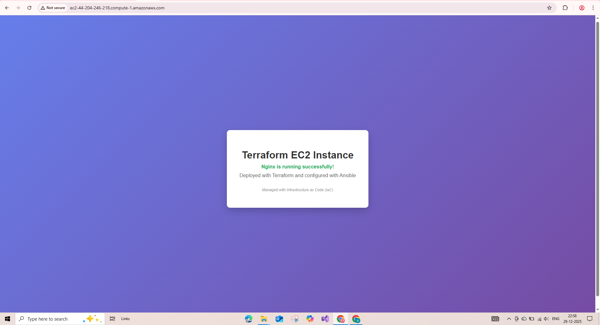

# Terraform + Ansible Multi-Environment Infrastructure

[](https://www.terraform.io/)
[](https://www.ansible.com/)
[](https://aws.amazon.com/ec2/)
[](LICENSE)

A production-ready Infrastructure as Code (IaC) solution for deploying and managing EC2 instances across multiple environments using Terraform and Ansible.



## 🚀 Features

- **Multi-Environment Support**: Separate configurations for test, staging, and production
- **Modular Architecture**: Reusable Terraform EC2 module
- **Automated Configuration**: Ansible roles for system updates and Nginx installation
- **Security Best Practices**: SSH key generation, security groups, least privilege access
- **Environment Agnostic**: Fully parameterized for easy customization
- **Infrastructure as Code**: Version-controlled, repeatable deployments
- **Dynamic Inventory**: Auto-generated Ansible inventory from Terraform outputs

## 📋 Quick Start

### 1. Prerequisites

- Terraform >= 1.0.0
- Ansible >= 2.10
- AWS CLI configured
- Python 3.6+

### 2. Clone & Deploy

```bash
# Clone repository
git clone https://github.com/alokraja075/terraform-ansible-multi-env.git
cd terraform-ansible-multi-env

# Initialize Terraform
terraform init

# Deploy infrastructure (test environment)
terraform apply -var-file="terraform.test.tfvars" -auto-approve

# Configure with Ansible
cd ansible
bash generate-inventory.sh
bash run-playbook.sh
```

### 3. Access Your Instance

```bash
# Get SSH command
terraform output SSH_Key_Command

# View website
curl http://$(terraform output -raw instance_public_dns)
```

## 🏗️ Architecture

```
┌─────────────────────────────────────┐
│         Terraform (IaC)             │
│  • EC2 Instances                    │
│  • Security Groups                  │
│  • SSH Key Pairs                    │
│  • EBS Volumes                      │
└──────────┬──────────────────────────┘
           │ Outputs
           ▼
┌─────────────────────────────────────┐
│      Ansible (Configuration)        │
│  • System Updates                   │
│  • Nginx Installation               │
│  • Service Management               │
└─────────────────────────────────────┘
```

## 📁 Project Structure

```
terraform-ansible-multi-env/
├── modules/ec2/              # Reusable EC2 module
├── ansible/                  # Ansible configuration
│   ├── roles/
│   │   ├── system-update/   # System update role
│   │   └── nginx/           # Nginx installation role
│   ├── playbook.yml         # Main playbook
│   └── inventory/           # Auto-generated inventory
├── terraform.test.tfvars    # Test environment config
├── terraform.prod.tfvars    # Production environment config
└── key/                     # SSH keys (auto-generated)
```

## ⚙️ Configuration

### Environment Variables

**Test Environment** (`terraform.test.tfvars`):
- Instance: `t3.micro`
- Storage: 10GB
- Public IP: Yes
- Monitoring: Off

**Production Environment** (`terraform.prod.tfvars`):
- Instance: `t3.small`
- Storage: 50GB
- Public IP: No
- Monitoring: On

### Deploy to Different Environments

```bash
# Test
terraform apply -var-file="terraform.test.tfvars"

# Production
terraform apply -var-file="terraform.prod.tfvars"
```

## 🔄 Deployment Workflow

```bash
# 1. Plan
terraform plan -var-file="terraform.test.tfvars"

# 2. Apply
terraform apply -var-file="terraform.test.tfvars"

# 3. Configure with Ansible
cd ansible && bash run-playbook.sh

# 4. Verify
curl http://$(terraform output -raw instance_public_dns)

# 5. Cleanup
terraform destroy -var-file="terraform.test.tfvars"
```

## 📦 Ansible Roles

### system-update
Updates packages and installs essential tools (curl, wget, git, vim)

```bash
ansible-playbook playbook.yml --tags system-update
```

### nginx
Installs and configures Nginx with custom homepage

```bash
ansible-playbook playbook.yml --tags nginx
```

## 🔍 Terraform Outputs

```bash
terraform output

# Outputs:
# - web_urls: Instance public DNS
# - instance_public_ip: Public IP address
# - instance_id: EC2 instance ID
# - SSH_Key_Command: Ready-to-use SSH command
```

## 🐛 Troubleshooting

### Common Issues

**Terraform: "Module not installed"**
```bash
terraform init
```

**Ansible: "Host unreachable"**
```bash
# Check key permissions
chmod 400 key/TestKP

# Test SSH
ssh -i key/TestKP ubuntu@<instance-dns>
```

**Website not accessible**
```bash
# Verify Nginx status
ssh -i key/TestKP ubuntu@<instance-dns> 'sudo systemctl status nginx'
```

## 📚 Documentation

- [Detailed Setup Guide](SETUP_GUIDE.md)
- [Ansible Documentation](ansible/README.md)
- [Terraform Module Documentation](modules/ec2/)

## 🤝 Contributing

Contributions welcome! Please submit a Pull Request.


## 👤 Author

**Alok Raja**
- GitHub: [@alokraja075](https://github.com/alokraja075)

## 🙏 Acknowledgments

- HashiCorp for Terraform
- Red Hat for Ansible
- AWS for cloud infrastructure

---

⚠️ **Note:** Destroy resources when not in use to avoid AWS charges:

```bash
terraform destroy -var-file="terraform.test.tfvars" -auto-approve
```

---

Made with ❤️ using Infrastructure as Code
